# Degree Plan

## Overview

- [UTA 2024-2025 Transfer Guide - Computer Engineering](https://cdn.web.uta.edu/-/media/project/website/admissions/_downloads/transfer/transfer-guides-2024-2025/college-of-engineering/tccns_college-of-engineering_computer-engineering_transfer-guide.ashx)
- [UTA: Computer Engineering - Bachelor of Science](https://www.uta.edu/academics/programs/computer-engineering-bs?level=ug&program=compeng)
- [UTA: Computer Engineering - Master of Science](https://www.uta.edu/academics/schools-colleges/engineering/academics/masters/computer-engineering)
- [UTA: Computer Engineering - Doctoral](https://www.uta.edu/academics/schools-colleges/engineering/academics/phd/computer-engineering)

## Road Map

Legend:
- ⭐ = required for Associate Degree
- 🔄 = Not yet taken & required for Bachelor of Science
- 💟 = Currently Enrolled
- ✅ = Taken and completed
- ✴️ = Intresting but not required
- ⁉️ = Prerequisite not taken
- ☑️ = TSI met

```mermaid
graph LR;
  A[NSOR-0010 ✅]
  A-->B0[INRW-0114 ☑️]-->B1[ENGL-1301 ✅]-->B2[ENGL-1302 ✅]
  B1-->B4[ENGL-2307 ✴️]
  B1-->B3[ENGL-2311 ✅]
  B1-->M1[⭐ HIST-1301 🔄]
  B1-->M2[⭐ HIST-1302 🔄]
  A-->D[SPCH-1321 ✅]
  A-->E[GOVT-2305 ✅]
  A-->F[⭐ GOVT-2306 🔄]
  C5-->C7[MATH-2415 🔄]
  A-->C1[MATH-0214 ✅]-->C2[MATH-1314 ✅]-->C3[MATH-2412 ✅]-->C4[MATH-2413 ✅]-->C5[MATH-2414 🔄💟]-->L2
  C4-->C6[MATH-2305 🔄]
  C4-->L1[⭐ PHYS-2425 🔄💟]-->L2[⭐ PHYS-2426 🔄]
  A-->G[KINE-1164 ✅]
  A-->H[ECON-2301 ✅]
  A-->I[ARTS-1301 ✅]
  A-->J1[COSC-1301 ⁉️]-->J2[COSC-1436 ✅]-->J3[COSC-1437 ✅]-->J4[COSC-2436 🔄]
  J2-->J5[COSC-2425 🔄]
  A-->K[⭐ PHIL-1301 🔄]
```

```mermaid
gantt
    title TCC AA Coursework - Completed
    dateFormat  YYYY-MM-DD
    axisFormat  %Y-%m

    section Spring '20
    ENGL‑1301            :done, 2020-01-13, 2020-05-08
    MATH‑0214            :done, 2020-01-13, 2020-05-08

    section Summer '20
    MATH‑1314            :done, 2020-06-01, 2020-08-07

    section Fall '20
    GOVT‑2305            :done, 2020-08-24, 2020-12-11
    KINE‑1164            :done, 2020-08-24, 2020-12-11

    section Spring '21
    ENGL‑1302            :done, 2021-01-11, 2021-05-07
    ENGL‑2311            :done, 2021-01-11, 2021-05-07
    ECON‑2301            :done, 2021-01-11, 2021-05-07

    section Spring '22
    MATH‑2412            :done, 2022-01-10, 2022-05-06
    ARTS‑1301            :done, 2022-01-10, 2022-05-06

    section Fall '22
    MATH‑2413            :done, 2022-08-22, 2022-12-09
    COSC‑1436            :done, 2022-08-22, 2022-12-09
```

## Courses

### NSOR-0010

### INRW-0114

### ENGL-1301

**Composition I**

- Semester Credit Hours: 3
- Lecture Hours: 3
- Laboratory Hours: 0

Intensive study of and practice in writing processes, from invention and researching to drafting, revising, and editing, both individually and collaboratively. Emphasis on effective rhetorical choices, including audience, purpose, arrangement, and style. Focus on writing the academic essay as a vehicle for learning, communicating, and critical analysis.

- Required Prerequisite(s): TSI Met in Reading and Writing

or

- Required Corequisite(s): INRW 0399 or INRW 0114 

### ENGL-1302

**Composition II**

- Semester Credit Hours: 3
- Lecture Hours: 3
- Laboratory Hours: 0

Intensive study of and practice in the strategies and techniques for developing research-based expository and persuasive texts. Emphasis on effective and ethical rhetorical inquiry, including primary and secondary research methods; critical reading of verbal, visual, and multimedia texts; systematic evaluation, synthesis, and documentation of information sources; and critical thinking about evidence and conclusions.

- Required Prerequisite(s): [ENGL-1301](#engl-1301)

### ENGL-2307

**Creative Writing I**

- Semester Credit Hours: 3
- Lecture Hours: 3
- Laboratory Hours: 0

Practical experience in the techniques of imaginative writing. May include fiction, nonfiction, poetry, screenwriting, or drama. Includes lectures on recognition and use of literary devices.

- Required Prerequisite(s): [ENGL-1301](#engl-1301)

### ENGL-2311

**Technical and Business Writing**

- Semester Credit Hours: 3
- Lecture Hours: 3
- Laboratory Hours: 0

Intensive study of and practice in professional settings. Focus on the types of documents necessary to make decisions and take action on the job, such as proposals, reports, instructions, policies and procedures, email messages, letters, and descriptions of products and services. Practice individual and collaborative processes involved in the creation of ethical and efficient documents.

- Required Prerequisite(s): [ENGL-1301](#engl-1301)

### HIST-1301

**United States History I**

- Semester Credit Hours: 3
- Lecture Hours: 3
- Laboratory Hours: 0

A survey of the social, political, economic, cultural, and intellectual history of the United States from the pre-Columbian era to the Civil War/Reconstruction period. United States History I includes the study of pre-Columbian, colonial, revolutionary, early national, slavery and sectionalism, and the Civil War/Reconstruction eras. Themes that may be addressed in United States History I include: American settlement and diversity, American culture, religion, civil and human rights, technological change, economic change, immigration and migration, and creation of the federal government.

- Required Prerequisite(s): [ENGL-1301](#engl-1301) with a grade of C or TSI Met in Reading and Writing

### HIST-1302

**United States History II**

- Semester Credit Hours: 3
- Lecture Hours: 3
- Laboratory Hours: 0

A survey of the social, political, economic, cultural, and intellectual history of the United States from the Civil War/Reconstruction era to the present. United States History II examines industrialization, immigration, world wars, the Great Depression, Cold War, and post-Cold War eras. Themes that may be addressed include: American culture, religion, civil and human rights, technological change, economic change, immigration and migration, urbanization and suburbanization, the expansion of the federal government, and the study of U.S. foreign policy.

- Required Prerequisite(s): [ENGL-1301](#engl-1301) with a grade of C or TSI Met in Reading and Writing

### SPCH-1321

**Business and Professional Communication**

- Semester Credit Hours: 3
- Lecture Hours: 3
- Laboratory Hours: 0

Study and application of communication within the business and professional context. Special emphasis will be given to communication competencies in presentations, dyads, teams and technologically mediated formats.

### GOVT-2305

**Federal Government (Federal Constitution & Topics)**

- Semester Credit Hours: 3
- Lecture Hours: 3
- Laboratory Hours: 0

Origin and development of the U.S. Constitution, structure and powers of the national government including the legislative, executive, and judicial branches, federalism, political participation, the national election process, public policy, civil liberties and civil rights.

- Required Prerequisite(s): TSI Met in Reading and Writing

### GOVT-2306

**Texas Government (Texas Constitution & Topics)**

- Semester Credit Hours: 3
- Lecture Hours: 3
- Laboratory Hours: 0

Origin and development of the Texas Constitution, structure and powers of state and local government, federalism and inter-governmental relations, political participation, the election process, public policy, and the political culture of Texas.

- Required Prerequisite(s): TSI Met in Reading and Writing

### MATH-0214

**Coreq College Algebra**

- Semester Credit Hours: 2
- Lecture Hours: 2
- Laboratory Hours: 0

This course supports students in developing skills, strategies, and reasoning needed to succeed in mathematics. It is designed to support students concurrently enrolled in MATH 1314 by providing additional focus on MATH-1314 topics and review of prerequisite topics as needed. If successful in the accompanying credit course, this satisfies a developmental math requirement.

- Required Prerequisite(s):
  1. TSI MATH score of 910-949 with diagnostic score of 4-5 or 
  2. MATH 1332 with a minimum grade of C or
  3. MATH 1342 with a minimum grade of C

- Required Corequisite(s): [MATH-1314](#math-1314)

### MATH-1314

**College Algebra**

- Semester Credit Hours: 3
- Lecture Hours: 3
- Laboratory Hours: 0

In-depth study and applications of polynomial, rational, radical, exponential and logarithmic functions, and systems of equations using matrices. Additional topics such as sequences, series, probability, and conics may be included.

- Required Prerequisite(s):
  1. TSI Met in Math or 
  2. TSI Math score of 910-949 with diagnostic score of 4-5 or MATH 1332 with a minimum grade of C or MATH 1342 with a minimum grade of C may take MATH-1314 with [MATH-0214](#math-0214)

### MATH-2412

**Pre-Calculus Math**

- Semester Credit Hours: 4
- Lecture Hours: 4
- Laboratory Hours: 1

In-depth combined study of algebra, trigonometry, and other topics for calculus readiness.

- Required Prerequisite(s): [MATH-1314](#math-1314) or MATH 1316 with a minimum grade of C or appropriate score on the college-level mathematics placement test.

### MATH-2413

**Calculus I**

- Semester Credit Hours: 4
- Lecture Hours: 4
- Laboratory Hours: 1

Limits and continuity; the fundamental Theorem of Calculus; definition of the derivative of a function and techniques of differentiation; applications of the derivative to maximizing or minimizing a function; the chain rule, mean value theorem, and rate of change problems; curve sketching; definite and indefinite integration of algebraic, trigonometric, and transcendental functions, with an application to calculation of areas.

- Required Prerequisite(s): [MATH-2412](#math-2412) with a minimum grade of C or appropriate score on the college-level mathematics placement test.

### MATH-2414

**Calculus II**

- Semester Credit Hours: 4
- Lecture Hours: 4
- Laboratory Hours: 0

Differentiation and integration of transcendental functions; parametric equations and polar coordinates; techniques of integration; sequences and series; and improper integrals.

- Required Prerequisite(s): [MATH-2413](#math-2413) with minimum grade of “C”.

### MATH-2415

**Calculus III**

- Semester Credit Hours: 4
- Lecture Hours: 4
- Laboratory Hours: 0

Advanced topics in calculus, including vectors and vector-valued functions, partial differentiation, Lagrange multipliers, multiple integrals, and Jacobians; application of the line integral, including Green’s Theorem, the Divergence Theorem, and Stokes’ Theorem.

- Required Prerequisite(s): [MATH-2414](#math-2414) with minimum grade of “C”.

### MATH-2305

**Discrete Mathematics**

- Semester Credit Hours: 3
- Lecture Hours: 3
- Laboratory Hours: 0

A course designed to prepare math, computer science, and engineering majors for a background in abstraction, notation, and critical thinking for the mathematics most directly related to computer science. Topics include: logic, relations, functions, basic set theory, countability and counting arguments, proof techniques, mathematical induction, combinatorics, discrete probability, recursion, sequence and recurrence, elementary number theory, graph theory, and mathematical proof techniques.

- Required Prerequisite(s): [MATH-2413](#math-2413) with a minimum grade of C

### PHYS-2425

**University Physics I** (Lecture + Lab)

- Semester Credit Hours: 4
- Lecture Hours: 3
- Laboratory Hours: 3

Fundamental principles of physics, using calculus, for science, computer science, and engineering majors; the principles and applications of classical mechanics, including harmonic motion, physical systems and thermodynamics; and emphasis on problem solving. Basic laboratory experiments supporting theoretical principles presented in lecture involving the principles and applications of classical mechanics, including harmonic motion and physical systems; experimental design, data collection and analysis, and preparation of laboratory reports.

- Required Prerequisite(s): [MATH-2413](#math-2413)

### PHYS-2426

**University Physics II** (Lecture + Lab)

- Semester Credit Hours: 4
- Lecture Hours: 3
- Laboratory Hours: 3

Principles of physics for science, computer science, and engineering majors, using calculus, involving the principles of electricity and magnetism, including circuits, electromagnetism, waves, sound, light, and optics. Laboratory experiments supporting theoretical principles presented in the lecture involving the principles of electricity and magnetism, including circuits, electromagnetism, waves, sound, light, and optics; experimental design, data collection and analysis, and preparation of laboratory reports. 

- Required Prerequisite(s): [PHYS-2425](#phys-2425) and [MATH-2414](#math-2414)

### KINE-1164

**Introduction to Physical Fitness and Wellness**

- Semester Credit Hours: 1
- Lecture Hours: 1
- Laboratory Hours: 2

This course will provide an overview of the lifestyle necessary for fitness and health. Students will participate in physical activities and assess their fitness status. Students will be introduced to proper nutrition, weight management, cardiovascular health, flexibility, and strength training. Includes:

1. Scientific information concerning values and preventive medical benefits of exercise.
2. Individual (personal) evaluations and experiments to determine present health fitness status.
3. Development of a personal exercise program based on student’s needs.

### ECON-2301

**Principles of Macroeconomics**

- Semester Credit Hours: 3
- Lecture Hours: 3
- Laboratory Hours: 0

An analysis of the economy as a whole including measurement and determination of Aggregate Demand and Aggregate Supply, national income, inflation, and unemployment. Other topics include international trade, economic growth, business cycles, and fiscal policy and monetary policy. Emphasis on the U.S. economy. Required for business and economics majors.

### ARTS-1301

**Art Appreciation**

- Semester Credit Hours: 3
- Lecture Hours: 3
- Laboratory Hours: 0

A general introduction to the visual arts designed to create an appreciation of the vocabulary, media, techniques, and purposes of the creative process. Students will critically interpret and evaluate works of art within formal, cultural, and historical contexts. General education course open to all; design principles from the layman’s point of view.

### PHIL-1301

**Introduction to Philosophy**

- Semester Credit Hours: 3
- Lecture Hours: 3
- Laboratory Hours: 0

A study of major issues in philosophy and/or the work of major philosophical figures in philosophy. Topics in philosophy may include theories of reality, theories of knowledge, theories of value, and their practical applications.
Required Prerequisite(s): TSI Met in Reading and Writing

### COSC-1301

**Introduction to Computing**

- Semester Credit Hours: 3
- Lecture Hours: 3
- Laboratory Hours: 1

Overview of computer systems-hardware, operating systems, the Internet, and application software including word processing, spreadsheets, presentation graphics, and databases. Current topics such as the effect of computers on society, and the history and use of computers in business, educational, and other interdisciplinary settings are also studied. This course is not intended to count toward a student’s major field of study in business or computer science.

### COSC-1436

**Programming Fundamentals I**

- Semester Credit Hours: 4
- Lecture Hours: 3
- Laboratory Hours: 2

Introduces the fundamental concepts of structured programming and provides a comprehensive introduction to programming for computer science and technology majors. Topics include software development methodology, data types, control structures, functions, arrays, and the mechanics of running, testing, and debugging. This course assumes computer literacy. This course is included in the Field of Study Curriculum for Computer Science.

- Recommended Prerequisite(s): [COSC11301](#cosc-1301)

### COSC-1437

**Programming Fundamentals II**

- Semester Credit Hours: 4
- Lecture Hours: 3
- Laboratory Hours: 2

This course focuses on the object-oriented programming paradigm, emphasizing the definition and use of classes along with fundamentals of object-oriented design. The course includes basic analysis of algorithms, searching and sorting techniques, and an introduction to software engineering processes. Students will apply techniques for testing and debugging software. (This course is included in the Field of Study Curriculum for Computer Science.)

- Required Prerequisite(s): [COSC-1436](#cosc-1436)

### COSC-2436

**Programming Fundamentals III**

- Semester Credit Hours: 4
- Lecture Hours: 3
- Laboratory Hours: 2

Further applications of programming techniques, introducing the fundamental concepts of data structures and algorithms. Topics include data structures (including stacks, queues, linked lists, hash tables, trees, and graphs), searching, sorting, recursion, and algorithm analysis. Programs will be implemented in an appropriate object oriented language. (This course is included in the Field of Study Curriculum for Computer Science.)

- Required Prerequisite(s): [COSC-1437](#cosc-1437)

### COSC-2425

**Computer Organization**

- Semester Credit Hours: 4
- Lecture Hours: 3
- Laboratory Hours: 2

The organization of computer systems is introduced using assembly language. Topics include basic concepts of computer architecture and organization, memory hierarchy, data types, computer arithmetic, control structures, interrupt handling, instruction sets, performance metrics, and the mechanics of testing and debugging computer systems. Embedded systems and device interfacing are introduced.

- Required Prerequisite(s): [COSC-1436](#cosc-1436)

### COSC-1420

**”C” Programming**

- Semester Credit Hours: 4
- Lecture Hours: 3
- Laboratory Hours: 2

Introduces the fundamental concepts of structured programming in the C language. Topics include data types; control structures; functions, structures, arrays, pointers, pointer arithmetic, unions, and files; the mechanics of running, testing, and debugging programs; introduction to programming; and introduction to the historical and social context of computing.

- Recommended Prerequisite(s): [COSC-1436](#cosc-1436)
